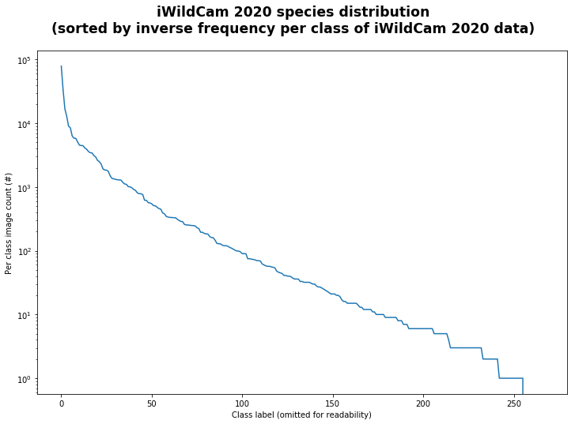
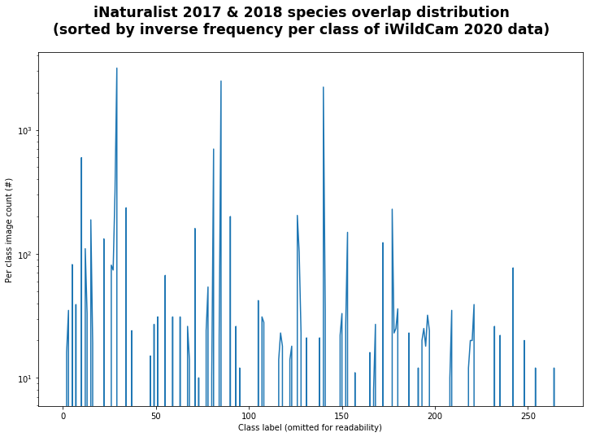
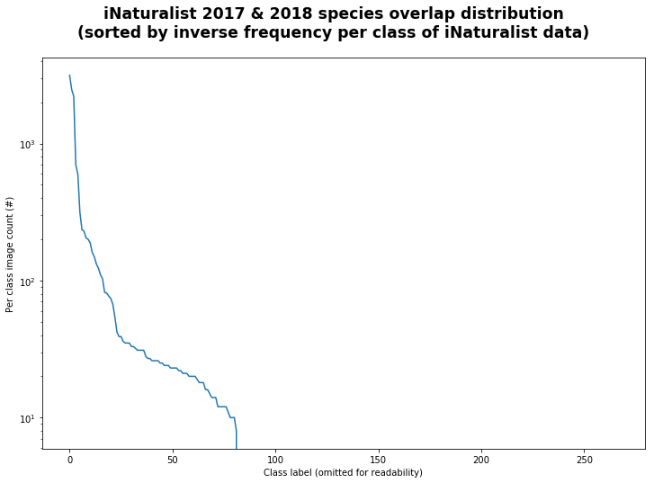
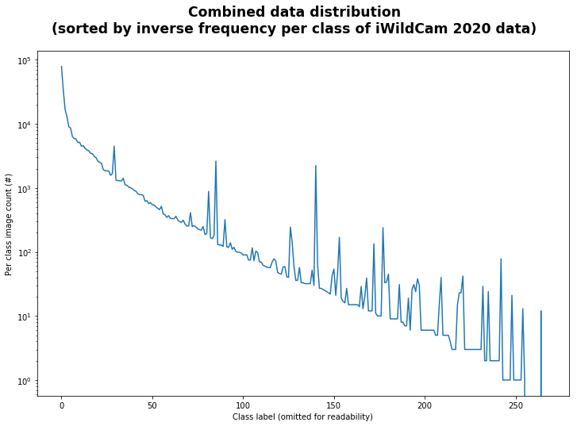

# iwildcam2020-inaturalist
Exploration into the iNaturalist augmentation dataset for the iWildCam 2020 challenge for FGVC7.

## Details
Along with the iWildCam 2020 dataset of camera trap images, we have provided links to a subset of images from a combination of the iNaturalist 2017 and 2018 challenge datasets. This augmentation dataset is constructed from the public datasets of these challenges and we have mapped the relevant category ids from those challenges to the category ids of this challenge. Here, we will examine this augmentation dataset qualitatively and quantitatively, in hopes of generating interest and spurring multimodal solutions to the iWildCam 2020 challenge.

## Quantitative analysis
Firstly, let's examine the training data distribution of iWildCam 2020 across the given classes. If we take all of the classes and the number of examples per class, sorting them by descending order, we can produce the following class distribution graph:

There are about 260 classes in the main iWildCam 2020 dataset. Although the label ids go to 600, about 400 ids are not used and do not exist in the labelmap. The iNaturalist augmentation dataset covers about 70 of those labels. If we keep the ordering as above, we can plot the iNaturalist data:

From this, we can see that the distribution of iNaturalist data does not follow the iWildCam 2020 data distribution. We can get some insight if we sort the iNaturalist dataset by the number of examples per class and we get this plot:

Also a long tailed dataset, these labels cover almost a third of the iWildCam 2020 label space. If we add these counts to the original iWildCam 2020 data distribution and keep sorting on the iWildCam 2020 camera trap images alone, we get the following plot:

## Qualitative analysis
Next, lets look at the content of the iNaturalist augmentation dataset. The main iWildCam 2020 dataset is composed of camera trap data, which presents a host a real world problems (detailed in the main competition page), as well as iNaturalist data and satellite imagery. The ultimate goal remains to classify a test set of camera trap images. However, we hope that a multimodal approach, using the iNaturalist data and the satellite imagery, could produce better results on this task. Let's take a look at some classes and how the images compare between iWildCam 2020 and the iNaturalist data.
